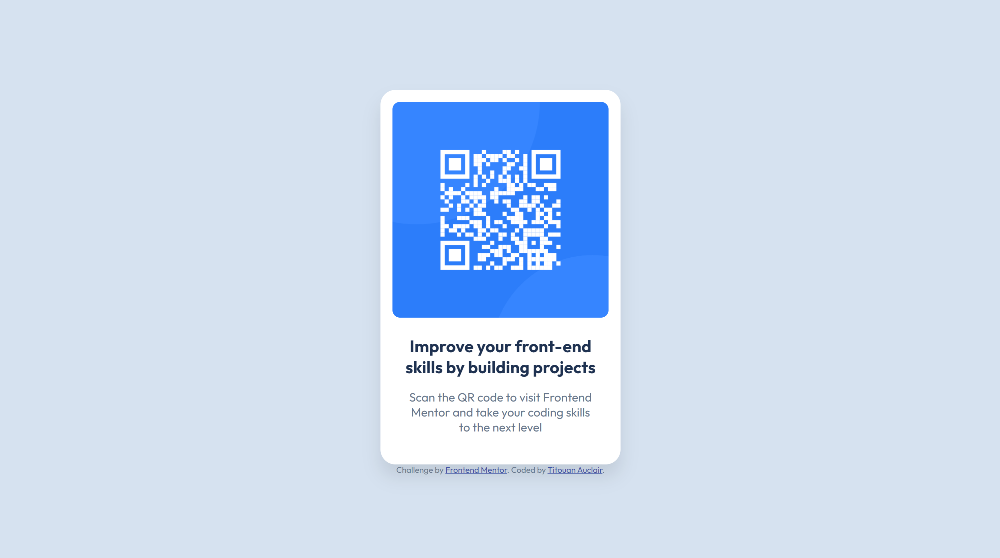

# Frontend Mentor - QR code component solution

This is my solution to the [QR code component challenge on Frontend Mentor](https://www.frontendmentor.io/challenges/qr-code-component-iux_sIO_H).

## Table of contents

- [Overview](#overview)
  - [Screenshot](#screenshot)
  - [Links](#links)
- [My process](#my-process)
  - [Built with](#built-with)
  - [Continued development](#continued-development)
- [Author](#author)
- [Acknowledgments](#acknowledgments)

## Overview

### Screenshot

### Links

- Solution URL: [Add solution URL here](https://your-solution-url.com)
- Live Site URL: [Live Site URL](https://titouan-aclr.github.io/FM_qr-code/)

## My process

### Built with

- Semantic HTML5 markup
- CSS
- SASS
- Flexbox

### Continued development

To keep up with this challenge, I'd like to refactor the CSS part to use SASS. I already started this part but still need to be finished.

## Author

- GitHub - [@titouan-aclr](https://github.com/titouan-aclr)
- Frontend Mentor - [@titouan-aclr](https://www.frontendmentor.io/profile/titouan-aclr)

## Acknowledgments

To improve my base code, I checked the solution proposed by [@ErwiniaDev](https://github.com/ErwiniaDev).
I also used the [reset.css](reset.css) file from https://dev.to/hankchizljaw/a-modern-css-reset-6p3
